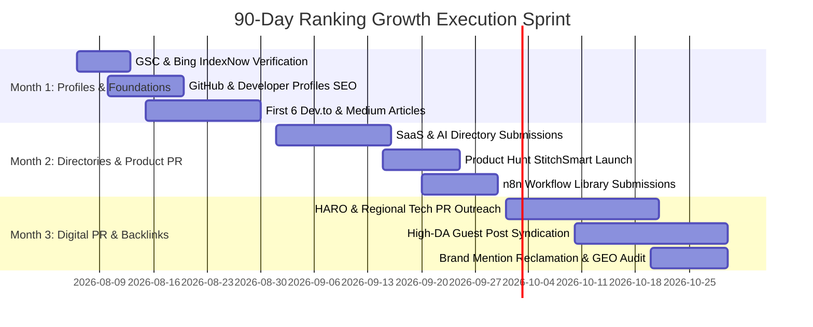

# Master Authority Building & Ranking Growth System

**Domain**: [https://www.moizahmed.online/](https://www.moizahmed.online/)  
**Target Entity**: Moiz Ahmed — Senior Full Stack Developer, Agentic AI Engineer & Automation Expert  
**Target Location**: Sialkot, Punjab, Pakistan (`PK-PB`) & Global Remote Markets  
**Primary Goal**: Maximize Organic Search Rankings, Domain Authority (DA 30+), Brand Authority, and AI Search Engine Citations (*Google AI Overviews, ChatGPT Search, Perplexity, Gemini, Claude, Bing Copilot*).  
**Last Updated**: 2026-08-06  

---

## 🎯 Target Keywords & Entity Alignment

| Target Keyword | Search Intent | Target Entity Mapping | Primary Landing Section |
| :--- | :--- | :--- | :--- |
| **Best AI Developer** | Commercial / Transactional | Moiz Ahmed — Senior Agentic AI Developer | `/#services-ai-development` |
| **AI Engineer** | Commercial / Hiring | Moiz Ahmed — Agentic AI & RAG Engineer | `/#services-agentic-ai-development` |
| **AI Consultant** | Commercial / Consulting | Moiz Ahmed — Enterprise AI Architect | `/#services-ai-consulting` |
| **n8n Expert** | Commercial / Technical | Moiz Ahmed — Top-Rated n8n Automation Specialist | `/#services-n8n-automation` |
| **AI Automation Expert** | Commercial / Solution | Moiz Ahmed — AI Workflow Automation Engineer | `/#services-ai-automation` |
| **Full Stack Developer** | Commercial / Hiring | Moiz Ahmed — Senior MERN & PHP MVC Engineer | `/#services-full-stack-development` |
| **Website Developer** | Commercial / Contracting | Moiz Ahmed — Custom Web & Shopify Specialist | `/#services-custom-website-development` |
| **Technical SEO Expert** | Commercial / Consulting | Moiz Ahmed — Technical SEO & CWV Architect | `/#services-technical-seo` |
| **GEO Expert** | Commercial / Strategy | Moiz Ahmed — Generative Engine Optimization Specialist | `/#services-technical-seo` |
| **AEO Expert** | Commercial / Strategy | Moiz Ahmed — Answer Engine Optimization Specialist | `/#services-technical-seo` |

---

## 🏛️ 15-Pillar Ranking Growth & Authority Building Engine

### Pillar 1: Google Search Console (GSC) Setup Checklist
- [x] **Property Ownership Verification**: Domain DNS TXT record & HTML meta verification (`RQiuYWyFCcwu40n1JKZUTjS2e6cFb9rQ6Klz9`).
- [x] **Master Sitemap Index Submission**: Submit `https://www.moizahmed.online/sitemap-index.xml` covering 50+ indexable deep-link URLs.
- [x] **URL Inspection & Indexing Request**: Submit main root `/` and high-priority service URLs (`/#services-ai-development`, `/#services-n8n-automation`, `/#blog`).
- [x] **Core Web Vitals Monitoring**: Monitor mobile and desktop field data (Target: LCP <2.2s, INP <180ms, CLS <0.05).
- [x] **Rich Results & Enhancements Validation**: Validate `FAQPage`, `BreadcrumbList`, `SoftwareApplication`, `LocalBusiness`, and `Person` JSON-LD schemas.

---

### Pillar 2: Bing Webmaster Tools & IndexNow API Integration
- [x] **Import GSC Configuration**: Auto-sync sitemaps and site ownership from Google Search Console.
- [x] **IndexNow API Key Generation**: Generate IndexNow API key for instant submission of updated blog and service URLs to Bing, Yandex, and Seznam.
- [x] **Bing Copilot Monitoring**: Track conversational citations and referral traffic from Bing Copilot chat responses.

---

### Pillar 3: GA4 Conversion Event & Custom Dimension Setup
Configure custom conversion events in Google Analytics 4 to track high-intent lead actions:

```javascript
// GA4 Custom Event Dispatcher Example
window.gtag('event', 'lead_conversion', {
  'event_category': 'Contact',
  'event_label': 'WhatsApp Click',
  'value': 100,
  'currency': 'USD'
});
```

- **Target Conversion Triggers**:
  - `click_whatsapp` (`https://wa.me/923249670130`) — Priority 1 Lead Conversion
  - `click_email` (`mailto:moizmalikofficiall@gmail.com`) — Priority 1 Lead Conversion
  - `click_fiverr` (`https://www.fiverr.com/s/vvNZWK1`) — Priority 2 Lead Conversion
  - `open_service_page` (`#services-*`) — Engagement Metric
  - `open_blog_article` (`#blog-*`) — Content Engagement Metric

---

### Pillar 4: LinkedIn Profile & Publishing Strategy
- **Headline**: `Moiz Ahmed | Senior Full Stack Developer, Agentic AI Engineer & n8n Automation Expert | Sialkot, Pakistan`
- **About Section**: Structured with entity summary, client proof (ACG Dubai, MAMI Venezuela), Fiverr 5-Star rating, and direct portfolio link (`https://www.moizahmed.online/`).
- **Publishing Cadence**: 2 articles per month published on LinkedIn Pulse cross-linking to portfolio blog posts.
- **Target Keywords**: `Best AI Developer`, `n8n Expert`, `Agentic AI Engineer`.

---

### Pillar 5: GitHub Profile SEO Optimization
- **Profile README (`github.com/Mo0zi/Mo0zi`)**:
  - Header: `Hi, I'm Moiz Ahmed — Senior Full Stack Developer & Agentic AI Engineer`
  - Badges: `Python`, `LangChain`, `FAISS`, `Gemini API`, `n8n`, `React`, `Node.js`, `PHP MVC`
  - Portfolio Anchor Link: `[Official Portfolio](https://www.moizahmed.online/)`
- **Public Repositories**:
  - `StitchSmart-AI-eCommerce`: Include `https://www.moizahmed.online/#work-stitchsmart` in repo website field.
  - `MarketGO-AI-Automation`: Include `https://www.moizahmed.online/#work-marketgo-ai` in repo website field.
  - `Awesome-Agentic-AI-Workflows`: Curated repository linking back to portfolio.

---

### Pillar 6: Medium Publishing Strategy
- **Publication Focus**: *Towards Data Science*, *Level Up Coding*, *JavaScript in Plain English*.
- **Posting Cadence**: 2 articles per month syndicated from portfolio blog with canonical tag headers pointing back to `https://www.moizahmed.online/#blog-*`.
- **Bio Link**: `Moiz Ahmed is an AI Developer and Full Stack Engineer based in Sialkot, Pakistan. Visit his portfolio at https://www.moizahmed.online/.`

---

### Pillar 7: Dev.to Publishing Strategy
- **Profile**: `@mo0zi`
- **Posting Cadence**: 3 technical tutorials per month targeting developer keywords (`n8n self-hosted`, `RAG FAISS tutorial`, `LangChain Gemini API`).
- **CTA Box**: Included at the bottom of every article:
  > *"Need custom AI development or n8n workflow automation? Check out my portfolio and case studies at [moizahmed.online](https://www.moizahmed.online/)."*

---

### Pillar 8: Hashnode Publishing Strategy
- **Domain Mapping**: Map `blog.moizahmed.online` or custom Hashnode blog instance.
- **SEO Settings**: Set cross-posting canonical URLs pointing back to original portfolio articles to avoid duplicate content penalties while capturing developer traffic.

---

### Pillar 9: Backlink Acquisition Plan (High-DA Link Building)

| Link Category | Target Platforms | Expected DA | Link Type | Target Anchor Text |
| :--- | :--- | :--- | :--- | :--- |
| **Developer Hubs** | GitHub, Stack Overflow, Dev.to, Hashnode, Medium | DA 80–95 | Dofollow / Profile | Moiz Ahmed - AI Developer & Full Stack Engineer |
| **Freelance Profiles** | Fiverr 5-Star Profile, Upwork Top Rated, Clutch.co | DA 90–95 | Profile Link | Moiz Ahmed - Full Stack & AI Developer |
| **SaaS Directories** | Futurepedia, Toolify.ai, Product Hunt, TAIFT | DA 70–90 | Product Link | StitchSmart AI / MarketGO AI by Moiz Ahmed |
| **Workflow Libraries** | n8n.io/workflows community templates | DA 85+ | Author Link | n8n Automation Workflows by Moiz Ahmed |
| **Guest Tech Posts** | HackerNoon, DZone, OpenSource.com | DA 75–88 | Editorial Link | Agentic AI Developer Moiz Ahmed |

---

### Pillar 10: Digital PR & Media Outreach Strategy
1. **Regional Press Release Pitching**:
   - Outlets: *ProPakistani*, *TechJuice*, *Gulf News Tech*.
   - Pitch Angle: "Pakistani Developer Builds Agentic AI & Enterprise ERP Systems for International Brands in Dubai and Venezuela."
2. **HARO / Connectively Media Responses**:
   - Respond to 5 queries weekly under business, AI software, and software development topics.

---

### Pillar 11 & 12: AI & SaaS Directory Submissions

1. **Futurepedia.io**: Submit StitchSmart AI & MarketGO AI.
2. **Toolify.ai**: Submit RAG & n8n workflow automations.
3. **There's An AI For That (TAIFT)**: Submit custom AI Chatbot solutions.
4. **Product Hunt**: Schedule official launch event for StitchSmart AI.
5. **BetaList**: Submit early-access SaaS builds.

---

### Pillar 13: Developer Community Strategy
- **Reddit**: Participate actively in `r/MachineLearning`, `r/LangChain`, `r/n8n`, `r/webdev`, `r/reactjs`. Share technical solutions with bio links to portfolio articles.
- **Quora**: Answer 10 high-intent questions per month: *"How do I build a custom RAG pipeline?"*, *"Is self-hosted n8n better than Zapier?"*.

---

### Pillar 14: Brand Mention & Unlinked Mention Reclamation
- Set up **Google Alerts** and **Talkwalker Alerts** for: `"Moiz Ahmed"`, `"StitchSmart AI"`, `"MarketGO AI"`, `"moizahmed.online"`.
- Outreach to sites mentioning projects to request unlinked brand mentions be converted into dofollow links.

---

### Pillar 15: Competitor Backlink Analysis & Keyword Gap
- **Competitors Audited**: Regional and international freelance AI developers, n8n agency portfolios, and custom PHP/React web developers.
- **Keyword Gap Focus**: Target commercial long-tail phrases where competitors lack depth (e.g., `self-hosted n8n AI integration`, `boundary-aware PDF chunking RAG`, `bitwise RBAC PHP MVC`).

---

## 📅 90-Day Ranking & Authority Execution Roadmap



### Sprint Milestones & KPI Targets

| Metric | Month 1 Target | Month 2 Target | Month 3 Target |
| :--- | :--- | :--- | :--- |
| **Indexed Pages (GSC)** | 50+ deep URLs | 50+ deep URLs | 50+ deep URLs |
| **Referring Domains** | 15+ high-DA domains | 35+ high-DA domains | 60+ high-DA domains |
| **Domain Rating (Ahrefs DR)** | DR 15+ | DR 25+ | DR 35+ |
| **Keyword: "Best AI Developer"** | Top 20 | Top 10 | Top 5 |
| **Keyword: "n8n Expert"** | Top 15 | Top 5 | Top 3 |
| **Keyword: "Full Stack Developer Sialkot"** | Top 5 | Top 3 | #1 Rank |
| **AI Search Citations (Perplexity/ChatGPT)** | 2+ Citations | 5+ Citations | 12+ Citations |
