# Phase 15 — Content Authority & 12-Month Editorial Calendar Playbook

**Domain**: [https://www.moizahmed.online/](https://www.moizahmed.online/)  
**Target Entity**: Moiz Ahmed — Senior Full Stack Developer, Agentic AI Engineer & Automation Expert  
**Target Location**: Sialkot, Punjab, Pakistan (`PK-PB`) & Global Remote Markets  
**Last Updated**: 2026-08-06  

---

## 1. Content Cluster & Pillar Architecture

To build topical authority that search engines (Google, Bing) and AI answer engines (ChatGPT, Perplexity, Gemini, Claude) recognize, content is organized into 4 primary topic pillars with supporting sub-clusters:

```mermaid
graph TD
    Pillar1["AI Development & Engineering (Pillar 1)"] --> Cluster1A["Agentic AI & Autonomous Agents"]
    Pillar1 --> Cluster1B["Retrieval-Augmented Generation (RAG)"]
    Pillar1 --> Cluster1C["LLM Fine-Tuning & Gemini/OpenAI APIs"]
    Pillar1 --> Cluster1D["Prompt Engineering & Vector Databases (FAISS)"]
    Pillar1 --> Cluster1E["Custom AI Chatbots & Customer Service Bots"]

    Pillar2["Business & Workflow Automation (Pillar 2)"] --> Cluster2A["n8n Self-Hosted & Cloud Automation"]
    Pillar2 --> Cluster2B["Make.com & Zapier Integration Pipelines"]
    Pillar2 --> Cluster2C["WhatsApp & Social Automation Funnels"]
    Pillar2 --> Cluster2D["CRM & Enterprise Process Automation"]
    Pillar2 --> Cluster2E["API Gateways & Webhook Architecture"]

    Pillar3["Full Stack & Web Engineering (Pillar 3)"] --> Cluster3A["PHP MVC & Lightweight Enterprise Frameworks"]
    Pillar3 --> Cluster3B["React.js, Next.js & Frontend Optimization"]
    Pillar3 --> Cluster3C["Node.js, Express & Microservice REST APIs"]
    Pillar3 --> Cluster3D["Shopify Liquid Custom Themes & Speed SEO"]
    Pillar3 --> Cluster3E["MySQL & MongoDB Database Performance"]

    Pillar4["Digital Growth & Search Engineering (Pillar 4)"] --> Cluster4A["Technical SEO & Core Web Vitals (LCP, INP, CLS)"]
    Pillar4 --> Cluster4B["Generative Engine Optimization (GEO)"]
    Pillar4 --> Cluster4C["Answer Engine Optimization (AEO)"]
    Pillar4 --> Cluster4D["Entity SEO & Google Knowledge Graph"]
    Pillar4 --> Cluster4E["Performance Marketing & Meta/Google Ads"]
```

---

## 2. 12-Month Editorial Calendar (24 High-Intent Articles)

### Month 1: Agentic AI & RAG Foundations
#### Article 1: *"Building Autonomous Agentic AI Workflows with LangChain and Google Gemini API"*
- **Primary Keyword**: `Agentic AI developer`
- **Secondary Keywords**: `LangChain agentic AI`, `autonomous AI workflows`, `Google Gemini API tutorial`
- **Search Intent**: Informational / Commercial Investigation
- **Target Audience**: CTOs, Tech Leads, Software Engineers, Product Managers
- **URL Slug**: `/blog/building-agentic-ai-workflows-langchain-gemini`
- **Meta Title**: Building Autonomous Agentic AI Workflows with LangChain & Gemini | Moiz Ahmed
- **Meta Description**: Step-by-step guide to building production-grade Agentic AI workflows using LangChain and Google Gemini API. Written by Moiz Ahmed, Senior Agentic AI Engineer.
- **Internal Links**: Link to [Work Projects](https://www.moizahmed.online/#work) (`MarketGO AI`) and [Services](https://www.moizahmed.online/#what-i-do).

#### Article 2: *"RAG Pipeline Architecture: Indexing Enterprise Data with FAISS Vector Search"*
- **Primary Keyword**: `RAG developer`
- **Secondary Keywords**: `RAG pipeline integration`, `FAISS vector search`, `enterprise vector database`
- **Search Intent**: Technical / Commercial
- **Target Audience**: Enterprise Architects, Data Engineers, AI Developers
- **URL Slug**: `/blog/rag-pipeline-architecture-faiss-vector-search`
- **Meta Title**: RAG Pipeline Architecture: FAISS Vector Database Guide | Moiz Ahmed
- **Meta Description**: Learn how to design low-latency RAG architectures using FAISS vector indexing and LLM embeddings. Case study examples from StitchSmart AI.
- **Internal Links**: Link to [StitchSmart Case Study](https://www.moizahmed.online/#work) and [FAQ Section](https://www.moizahmed.online/#faq).

---

### Month 2: n8n & Workflow Automation
#### Article 3: *"Self-Hosting n8n for Business Process Automation: An Enterprise Guide"*
- **Primary Keyword**: `n8n expert`
- **Secondary Keywords**: `n8n automation expert`, `self-hosted n8n tutorial`, `workflow automation expert`
- **Search Intent**: Commercial / Informational
- **Target Audience**: Operations Directors, IT Managers, Automation Engineers
- **URL Slug**: `/blog/self-hosting-n8n-business-process-automation`
- **Meta Title**: Self-Hosting n8n for Enterprise Workflow Automation | Moiz Ahmed
- **Meta Description**: Complete guide to self-hosting n8n workflows for enterprise process automation. Reduce SaaS costs and maintain data privacy with custom n8n pipelines.
- **Internal Links**: Link to [Services](https://www.moizahmed.online/#what-i-do) and [Contact Section](https://www.moizahmed.online/#contact).

#### Article 4: *"n8n vs Make.com vs Zapier: Choosing the Right Automation Platform in 2026"*
- **Primary Keyword**: `n8n vs Make vs Zapier`
- **Secondary Keywords**: `automation consultant`, `business automation expert`, `n8n developer`
- **Search Intent**: Commercial Comparison
- **Target Audience**: Business Owners, SaaS Founders, Operations Managers
- **URL Slug**: `/blog/n8n-vs-make-vs-zapier-automation-comparison`
- **Meta Title**: n8n vs Make.com vs Zapier: 2026 Enterprise Automation Comparison
- **Meta Description**: Deep-dive technical comparison of n8n, Make.com, and Zapier for business automation. Security, pricing, API limits, and AI integration evaluated.
- **Internal Links**: Link to [FAQ Section](https://www.moizahmed.online/#faq) and [WhatsApp Contact](https://wa.me/923249670130).

---

### Month 3: Enterprise Web & PHP MVC
#### Article 5: *"Optimizing Custom PHP MVC Architectures for High-Volume B2B eCommerce"*
- **Primary Keyword**: `PHP developer`
- **Secondary Keywords**: `PHP MVC framework`, `B2B eCommerce developer`, `custom ERP developer`
- **Search Intent**: Informational / Commercial
- **Target Audience**: Lead Developers, eCommerce Managers, Apparel Manufacturers
- **URL Slug**: `/blog/optimizing-php-mvc-architectures-b2b-ecommerce`
- **Meta Title**: Optimizing Custom PHP MVC Frameworks for B2B eCommerce | Moiz Ahmed
- **Meta Description**: Architectural breakdown of high-performance PHP MVC engines. Learn how Haash Wears and PARWAY-ERP achieved 140ms TTFB under heavy load.
- **Internal Links**: Link to [PARWAY-ERP Case Study](https://www.moizahmed.online/#work) and [Haash Wears B2B](https://www.moizahmed.online/#work).

#### Article 6: *"Building Transaction-Safe Manufacturing ERP Systems with PHP & MySQL"*
- **Primary Keyword**: `ERP developer`
- **Secondary Keywords**: `manufacturing ERP system`, `apparel ERP software`, `PHP MySQL ERP`
- **Search Intent**: Commercial Solution
- **Target Audience**: Apparel Factory Owners, Supply Chain Managers, ERP Consultants
- **URL Slug**: `/blog/building-manufacturing-erp-systems-php-mysql`
- **Meta Title**: Building Manufacturing ERP Software with PHP & MySQL | Moiz Ahmed
- **Meta Description**: How to build transaction-safe ERP systems for apparel lot tracking, worker wage automation, and financial ledgers using custom PHP MVC.
- **Internal Links**: Link to [PARWAY-ERP Case Study](https://www.moizahmed.online/#work) and [About Moiz Ahmed](https://www.moizahmed.online/#about).

---

### Month 4: Shopify & Core Web Vitals
#### Article 7: *"Shopify Speed Optimization: Eliminating App Bloat in Custom Liquid Themes"*
- **Primary Keyword**: `Shopify developer`
- **Secondary Keywords**: `Shopify custom liquid themes`, `Shopify Core Web Vitals`, `Shopify speed optimization`
- **Search Intent**: Commercial / How-To
- **Target Audience**: Shopify Store Owners, eCommerce Directors
- **URL Slug**: `/blog/shopify-speed-optimization-custom-liquid-themes`
- **Meta Title**: Shopify Custom Liquid Theme Speed Optimization Guide | Moiz Ahmed
- **Meta Description**: Eliminate third-party script bloat and achieve sub-1-second mobile load times on Shopify using custom Liquid theme engineering.
- **Internal Links**: Link to [Shopify Projects](https://www.moizahmed.online/#work) and [Services](https://www.moizahmed.online/#what-i-do).

#### Article 8: *"Mastering Core Web Vitals (LCP, INP, CLS) for React & Single Page Apps"*
- **Primary Keyword**: `Core Web Vitals expert`
- **Secondary Keywords**: `LCP optimization React`, `INP score improvement`, `technical SEO consultant`
- **Search Intent**: Technical Guide
- **Target Audience**: Frontend Engineers, Technical SEO Managers
- **URL Slug**: `/blog/mastering-core-web-vitals-react-spa`
- **Meta Title**: Core Web Vitals Optimization for React & SPAs | Moiz Ahmed
- **Meta Description**: Technical strategies to pass Google Core Web Vitals (LCP, INP, CLS) on single-page React applications with heavy animation libraries.
- **Internal Links**: Link to [Tech Stack Section](https://www.moizahmed.online/#tech-stack) and [Portfolio Case Study](https://www.moizahmed.online/#work).

---

### Month 5: AI Search (GEO / AEO) & Entity SEO
#### Article 9: *"Generative Engine Optimization (GEO): Ranking in Google AI Overviews & ChatGPT"*
- **Primary Keyword**: `GEO expert`
- **Secondary Keywords**: `Generative Engine Optimization`, `AI Search Optimization`, `ranking in ChatGPT`
- **Search Intent**: Informational / Thought Leadership
- **Target Audience**: SEO Directors, Digital Marketing Managers, Business Owners
- **URL Slug**: `/blog/generative-engine-optimization-geo-guide`
- **Meta Title**: Generative Engine Optimization (GEO) Complete Guide | Moiz Ahmed
- **Meta Description**: Learn how to optimize content for AI search engines like Google AI Overviews, ChatGPT Search, Perplexity, and Claude.
- **Internal Links**: Link to [Services](https://www.moizahmed.online/#what-i-do) and [FAQ Section](https://www.moizahmed.online/#faq).

#### Article 10: *"Entity SEO & Schema Graphs: Building Knowledge Panels for Developers & Brands"*
- **Primary Keyword**: `Entity SEO expert`
- **Secondary Keywords**: `Google Knowledge Graph optimization`, `JSON-LD schema graph`, `Entity SEO tutorial`
- **Search Intent**: Technical Guide
- **Target Audience**: SEO Specialists, Digital Strategists, Web Developers
- **URL Slug**: `/blog/entity-seo-schema-graphs-knowledge-panels`
- **Meta Title**: Entity SEO & JSON-LD Schema Graph Optimization | Moiz Ahmed
- **Meta Description**: Master Entity SEO and Schema.org JSON-LD graphs to secure Google Knowledge Panels and establish semantic brand authority.
- **Internal Links**: Link to [About Moiz Ahmed](https://www.moizahmed.online/#about) and [Contact Section](https://www.moizahmed.online/#contact).

---

### Month 6: Full Stack Engineering & Microservices
#### Article 11: *"Designing Scalable Node.js & Express REST APIs for Real-Time AI SaaS"*
- **Primary Keyword**: `Node.js developer`
- **Secondary Keywords**: `Express.js REST API`, `full stack web developer`, `AI SaaS architecture`
- **Search Intent**: Technical / Architectural
- **Target Audience**: Full Stack Engineers, Backend Developers, SaaS Founders
- **URL Slug**: `/blog/scalable-nodejs-express-rest-api-ai-saas`
- **Meta Title**: Scalable Node.js & Express REST API Architecture for AI SaaS | Moiz Ahmed
- **Meta Description**: Architecting high-availability Node.js and Express REST API gateways for multi-tenant AI SaaS applications.
- **Internal Links**: Link to [MarketGO AI Project](https://www.moizahmed.online/#work) and [Services](https://www.moizahmed.online/#what-i-do).

#### Article 12: *"MongoDB vs MySQL: Database Design Strategies for Hybrid Enterprise Web Apps"*
- **Primary Keyword**: `Database architecture expert`
- **Secondary Keywords**: `MongoDB vs MySQL eCommerce`, `relational database design`, `PHP MySQL developer`
- **Search Intent**: Technical Comparison
- **Target Audience**: Database Administrators, Software Architects
- **URL Slug**: `/blog/mongodb-vs-mysql-database-design-strategies`
- **Meta Title**: MongoDB vs MySQL: Enterprise Database Design Strategies | Moiz Ahmed
- **Meta Description**: Compare document vs relational schema designs for hybrid B2B/B2C platforms, inventory ledgers, and vector search metadata.
- **Internal Links**: Link to [StitchSmart Case Study](https://www.moizahmed.online/#work) and [CCPD Portal](https://www.moizahmed.online/#work).

---

### Month 7: WhatsApp & CRM Automation
#### Article 13: *"Automating Customer Support & Sales Funnels with WhatsApp Cloud API & n8n"*
- **Primary Keyword**: `WhatsApp automation expert`
- **Secondary Keywords**: `WhatsApp n8n integration`, `CRM automation expert`, `WhatsApp AI bot`
- **Search Intent**: Commercial Solution
- **Target Audience**: Marketing Directors, Customer Support Managers, E-commerce Owners
- **URL Slug**: `/blog/whatsapp-cloud-api-n8n-automation-funnels`
- **Meta Title**: WhatsApp Cloud API & n8n Automation Guide | Moiz Ahmed
- **Meta Description**: How to build automated 24/7 sales and support funnels using WhatsApp Cloud API, n8n workflows, and OpenAI models.
- **Internal Links**: Link to [Services](https://www.moizahmed.online/#what-i-do) and [WhatsApp Direct Chat](https://wa.me/923249670130).

#### Article 14: *"Connecting Enterprise CRMs with Custom REST APIs and Visual Automation Tools"*
- **Primary Keyword**: `CRM automation expert`
- **Secondary Keywords**: `API integration expert`, `n8n CRM integration`, `Zapier CRM workflow`
- **Search Intent**: Commercial Guide
- **Target Audience**: Enterprise Operations Managers, Sales Operations Leads
- **URL Slug**: `/blog/connecting-enterprise-crms-rest-apis-automation`
- **Meta Title**: Connecting Enterprise CRMs with Custom REST APIs & Automation | Moiz Ahmed
- **Meta Description**: Integrate Salesforce, HubSpot, and custom databases using REST API webhooks, n8n, and Make.com workflows.
- **Internal Links**: Link to [Services](https://www.moizahmed.online/#what-i-do) and [Contact Section](https://www.moizahmed.online/#contact).

---

### Month 8: Prompt Engineering & Custom LLM Bots
#### Article 15: *"Advanced Prompt Engineering: Structuring LLM Outputs with JSON Schema"*
- **Primary Keyword**: `Prompt engineering expert`
- **Secondary Keywords**: `structured output LLM`, `JSON schema prompt engineering`, `Gemini API structured data`
- **Search Intent**: Technical How-To
- **Target Audience**: AI Developers, Prompt Engineers, Data Scientists
- **URL Slug**: `/blog/advanced-prompt-engineering-json-schema-outputs`
- **Meta Title**: Advanced Prompt Engineering: Structured JSON LLM Outputs | Moiz Ahmed
- **Meta Description**: Techniques for enforcing deterministic JSON schema outputs from Gemini API and OpenAI GPT models for reliable API integrations.
- **Internal Links**: Link to [StitchSmart Project](https://www.moizahmed.online/#work) and [AI Solutions](https://www.moizahmed.online/#work).

#### Article 16: *"Building Custom Customer Service AI Chatbots with Zero Data Leakage"*
- **Primary Keyword**: `AI chatbot developer`
- **Secondary Keywords**: `custom AI chatbot`, `secure enterprise AI chatbot`, `LangChain customer service bot`
- **Search Intent**: Commercial Solution
- **Target Audience**: Customer Experience Officers, IT Security Managers, SaaS Founders
- **URL Slug**: `/blog/building-secure-custom-ai-chatbots-zero-data-leakage`
- **Meta Title**: Secure Custom AI Chatbot Development Guide | Moiz Ahmed
- **Meta Description**: Design customer service AI chatbots with strict data privacy, local vector search, and zero sensitive data leakage.
- **Internal Links**: Link to [FAQ Section](https://www.moizahmed.online/#faq) and [Contact Section](https://www.moizahmed.online/#contact).

---

### Month 9: B2B eCommerce & Custom Portals
#### Article 17: *"Hybrid B2B & B2C eCommerce Architecture: Dual-Pricing in a Single Platform"*
- **Primary Keyword**: `B2B eCommerce developer`
- **Secondary Keywords**: `hybrid eCommerce platform`, `PHP B2B portal`, `custom wholesale eCommerce`
- **Search Intent**: Commercial Solution
- **Target Audience**: B2B Wholesalers, Manufacturers, eCommerce Consultants
- **URL Slug**: `/blog/hybrid-b2b-b2c-ecommerce-architecture-guide`
- **Meta Title**: Hybrid B2B & B2C eCommerce Architecture Guide | Moiz Ahmed
- **Meta Description**: Architecting a single web application supporting retail B2C shopping alongside tier-based wholesale B2B bulk ordering.
- **Internal Links**: Link to [StitchSmart Case Study](https://www.moizahmed.online/#work) and [Haash Wears B2B](https://www.moizahmed.online/#work).

#### Article 18: *"Bitwise Role-Based Access Control (RBAC) in Enterprise Web Platforms"*
- **Primary Keyword**: `Software engineer`
- **Secondary Keywords**: `PHP MVC security`, `role-based access control tutorial`, `enterprise web portal security`
- **Search Intent**: Technical Guide
- **Target Audience**: Senior Software Engineers, Security Architects
- **URL Slug**: `/blog/bitwise-role-based-access-control-rbac-php`
- **Meta Title**: Bitwise Role-Based Access Control (RBAC) Architecture | Moiz Ahmed
- **Meta Description**: Implement high-performance bitwise permission validation middleware for institutional multi-tier web platforms.
- **Internal Links**: Link to [CCPD Enterprise Platform](https://www.moizahmed.online/#work) and [Career Timeline](https://www.moizahmed.online/#career).

---

### Month 10: Performance Marketing & Ad Automation
#### Article 19: *"AI-Driven Performance Marketing: Scaling Meta & Google Ads Campaigns"*
- **Primary Keyword**: `Digital marketing expert`
- **Secondary Keywords**: `Meta Ads expert`, `Google Ads PPC consultant`, `AI marketing automation`
- **Search Intent**: Commercial Service
- **Target Audience**: Brand Directors, CMOs, E-commerce Growth Managers
- **URL Slug**: `/blog/ai-performance-marketing-meta-google-ads`
- **Meta Title**: AI Performance Marketing: Scaling Meta & Google Ads | Moiz Ahmed
- **Meta Description**: How data-driven ad strategies, automated copy generation, and retargeting funnels scaled brands in Dubai (UAE) and Venezuela.
- **Internal Links**: Link to [Reviews Section](https://www.moizahmed.online/#reviews) and [Career Experience](https://www.moizahmed.online/#career).

#### Article 20: *"Automating Content Strategy & Paid Ad Creatives with AI Multi-Agent Systems"*
- **Primary Keyword**: `Marketing automation expert`
- **Secondary Keywords**: `AI content strategy`, `multi-agent ad generation`, `MarketGO AI`
- **Search Intent**: Thought Leadership / Product Demo
- **Target Audience**: Marketing Agencies, Growth Marketers, SaaS Founders
- **URL Slug**: `/blog/automating-content-strategy-ad-creatives-ai-agents`
- **Meta Title**: Automating Content Strategy & Paid Ad Creatives with AI | Moiz Ahmed
- **Meta Description**: Discover how autonomous multi-agent LLM systems generate high-converting ad creative copy and campaign structures automatically.
- **Internal Links**: Link to [MarketGO AI Case Study](https://www.moizahmed.online/#work) and [Services](https://www.moizahmed.online/#what-i-do).

---

### Month 11: Python, FastAPI & LLM Middleware
#### Article 21: *"FastAPI vs Express.js: Choosing a Backend Framework for Python LLM Microservices"*
- **Primary Keyword**: `FastAPI developer`
- **Secondary Keywords**: `Python developer`, `Express.js vs FastAPI`, `LLM backend framework`
- **Search Intent**: Technical Comparison
- **Target Audience**: Python Developers, Node.js Engineers, Backend Architects
- **URL Slug**: `/blog/fastapi-vs-express-python-llm-microservices`
- **Meta Title**: FastAPI vs Express.js for Python LLM Microservices | Moiz Ahmed
- **Meta Description**: Benchmark comparison of async Python FastAPI vs Node.js Express for serving streaming LLM responses and vector embeddings.
- **Internal Links**: Link to [Tech Stack Section](https://www.moizahmed.online/#tech-stack) and [AI Solutions](https://www.moizahmed.online/#work).

#### Article 22: *"Parsing Complex PDF Documents into Semantic Embeddings for RAG"*
- **Primary Keyword**: `RAG pipeline developer`
- **Secondary Keywords**: `PDF document parser Python`, `semantic chunking tutorial`, `FAISS document ingestion`
- **Search Intent**: Technical How-To
- **Target Audience**: AI Engineers, Document Processing Teams, Data Engineers
- **URL Slug**: `/blog/parsing-pdf-documents-semantic-embeddings-rag`
- **Meta Title**: Parsing Complex PDFs into Semantic RAG Embeddings | Moiz Ahmed
- **Meta Description**: Technical walkthrough of boundary-aware semantic PDF chunkers that preserve tabular data and headings for FAISS vector indexing.
- **Internal Links**: Link to [AI Solutions Case Study](https://www.moizahmed.online/#work) and [FAQ Section](https://www.moizahmed.online/#faq).

---

### Month 12: Technical SEO & Modern Web Stack
#### Article 23: *"Technical SEO Audit Checklist for Single Page Applications (React/Vite)"*
- **Primary Keyword**: `Technical SEO expert`
- **Secondary Keywords**: `React SEO audit checklist`, `SPA SEO indexability`, `Vite React SEO`
- **Search Intent**: Technical Checklist
- **Target Audience**: Technical SEO Consultants, Web Developers, Agency Owners
- **URL Slug**: `/blog/technical-seo-audit-checklist-react-vite-spa`
- **Meta Title**: Technical SEO Audit Checklist for React & Vite SPAs | Moiz Ahmed
- **Meta Description**: Comprehensive 25-point technical SEO checklist for single-page React/Vite applications covering dynamic metadata, hydration, and schemas.
- **Internal Links**: Link to [Portfolio Case Study](https://www.moizahmed.online/#work) and [Contact Section](https://www.moizahmed.online/#contact).

#### Article 24: *"The Future of AI Search: Preparing Web Applications for Perplexity, ChatGPT & Gemini"*
- **Primary Keyword**: `AI Search Optimization`
- **Secondary Keywords**: `Answer Engine Optimization AEO`, `GEO best practices`, `future of search engine optimization`
- **Search Intent**: Thought Leadership / Visionary
- **Target Audience**: Business Executives, CMOs, Digital Strategists
- **URL Slug**: `/blog/future-of-ai-search-preparing-web-apps-perplexity-chatgpt`
- **Meta Title**: The Future of AI Search: Preparing Apps for Perplexity & ChatGPT
- **Meta Description**: Strategic roadmap for transitioning from traditional Google SERP SEO to AI answer engine optimization and Knowledge Graph presence.
- **Internal Links**: Link to [About Moiz Ahmed](https://www.moizahmed.online/#about) and [Fiverr Profile](https://www.fiverr.com/s/vvNZWK1).

---

## 3. Rules for Writing AI-Citable Content (GEO / AEO)

To maximize inclusion in **Google AI Overviews, ChatGPT Search, Perplexity, Gemini, and Claude citations**:

1. **The Lead Paragraph Rule**: Start every article and section with a direct, factual 40–50 word definition statement ("*Agentic AI refers to...*").
2. **Entity Co-occurrence**: Ensure brand name (`Moiz Ahmed`), role (`Senior Full Stack Developer & Agentic AI Engineer`), location (`Sialkot, Pakistan`), and core technologies appear in close proximity within summary blocks.
3. **Structured Data Tables**: Use comparison tables with explicit headers for technical evaluations (e.g., n8n vs Zapier comparison).
4. **Speakable Meta Selectors**: Indicate main entity definitions using CSS selectors in `SpeakableSpecification` schema tags.
