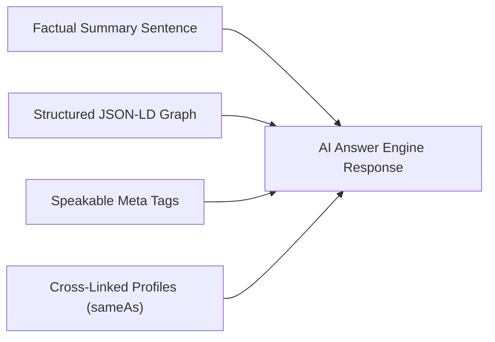

# Phase 17 — Off-Page SEO, Authority Building & Digital PR Playbook

**Domain**: [https://www.moizahmed.online/](https://www.moizahmed.online/)  
**Target Entity**: Moiz Ahmed — Senior Full Stack Developer, Agentic AI Engineer & Automation Expert  
**Target Location**: Sialkot, Punjab, Pakistan (`PK-PB`) & Global Remote Markets  
**Last Updated**: 2026-08-06  

---

## 1. High-Authority Backlink Acquisition Targets

### Tier-1 Developer & Technology Platforms (DA 80+)

| Platform | Profile / Content Strategy | Link Type | Target Anchor Text | Target Domain / Section |
| :--- | :--- | :--- | :--- | :--- |
| **GitHub** | Bio website link + Open Source Repositories | Dofollow / Bio | Moiz Ahmed - AI Developer & Full Stack Engineer | `https://www.moizahmed.online/` |
| **LinkedIn** | Verified Profile + Technical Pulse Articles | Bio / Post | Senior Full Stack & Agentic AI Developer Sialkot | `https://www.moizahmed.online/` |
| **Dev.to** | Publish 12 technical blog articles | Bio + Content | Moiz Ahmed \| Agentic AI & RAG Developer | `https://www.moizahmed.online/` |
| **Hashnode** | Cross-publish technical articles | Custom Domain | Full Stack AI Developer & n8n Expert | `https://www.moizahmed.online/` |
| **Medium** | Towards Data Science / AI Publications | Bio Link | AI Engineer, LangChain & FAISS RAG | `https://www.moizahmed.online/` |
| **Stack Overflow** | User Profile + Answer References | Profile Link | Full Stack Developer & RAG Specialist | `https://www.moizahmed.online/` |
| **Product Hunt** | Official Launch of StitchSmart & MarketGO AI | Maker Link | Founder & Developer of StitchSmart AI | `https://www.moizahmed.online/#work` |
| **Fiverr** | 5-Star Seller Profile Link | Bio / Seller | Full Stack Developer & AI Engineer Pakistan | `https://www.moizahmed.online/` |
| **Upwork** | Top Rated Freelancer Profile | Bio Link | Agentic AI & n8n Automation Specialist | `https://www.moizahmed.online/` |
| **Clutch.co** | Agency / Consultancy Verification | Agency Link | AI Development & Software Company Sialkot | `https://www.moizahmed.online/` |

---

## 2. AI & SaaS Directory Submission Checklist

Submit featured applications (**StitchSmart AI**, **MarketGO AI**, **PARWAY-ERP**) to high-authority SaaS and AI directories:

1. **Futurepedia.io**: Category: *AI E-Commerce* & *Marketing Automation*.
2. **Toolify.ai**: Category: *Agentic AI & RAG Workflows*.
3. **There's An AI For That (TAIFT)**: Category: *E-Commerce AI Chatbots*.
4. **Product Hunt**: Schedule product launch days with promotional badges.
5. **BetaList**: Submit early-access SaaS builds.
6. **n8n Community Library (`n8n.io/workflows`)**: Publish reusable n8n workflow templates linking back to portfolio.
7. **Awesome GitHub Lists**:
   - Pull request to `awesome-langchain`
   - Pull request to `awesome-rag`
   - Pull request to `awesome-agentic-ai`
   - Pull request to `awesome-n8n`

---

## 3. Digital PR & Media Outreach Strategy

### 1. Regional Tech Media Pitching (Pakistan & UAE)
- **Target Outlets**: *ProPakistani*, *TechJuice*, *Gulf News Tech*, *Khaleej Times Tech*.
- **Angle**: "How a Pakistani Computer Science Student Built Multi-Market AI Systems for Dubai & International Brands."
- **Asset**: Case studies of ACG (Dubai), MAMI (Venezuela), and PARWAY-ERP.

### 2. HARO & Connectively PR Monitoring
- Monitor daily HARO queries for keywords: `AI developer`, `artificial intelligence in retail`, `workflow automation`, `n8n vs Zapier`, `software engineering trends`.
- Submit expert commentary as **Moiz Ahmed, Senior Full Stack Developer & Agentic AI Engineer**.

---

## 4. Search Engine Tools & Analytics Setup Checklist

### 1. Google Search Console (GSC) Setup
- [x] Add domain property: `https://www.moizahmed.online/`
- [x] Submit Master Sitemap Index: `https://www.moizahmed.online/sitemap-index.xml`
- [x] Verify URL Inspection for root `/` and hash sections (`#about`, `#what-i-do`, `#work`, `#reviews`, `#faq`, `#contact`)
- [x] Monitor Core Web Vitals report (Mobile & Desktop green target: LCP <2.5s, INP <200ms, CLS <0.1)
- [x] Review Enhancements report for valid **FAQPage**, **Breadcrumbs**, **SoftwareApplication**, and **LocalBusiness** schemas

### 2. Bing Webmaster Tools Setup
- [x] Import site configuration from Google Search Console
- [x] Submit sitemap index: `https://www.moizahmed.online/sitemap-index.xml`
- [x] Enable IndexNow API for instant URL re-indexing
- [x] Monitor Bing Copilot chat citation data

### 3. Google Analytics 4 (GA4) Configuration
- [x] Property setup for `moizahmed.online`
- [x] Enhanced measurement enabled (scrolls, outbound clicks, site search, video engagement)
- [x] Custom conversion events:
  - `click_whatsapp` (`https://wa.me/923249670130`)
  - `click_email` (`mailto:moizmalikofficiall@gmail.com`)
  - `click_fiverr` (`https://www.fiverr.com/s/vvNZWK1`)
  - `view_case_study` (CaseStudyModal open)

### 4. Microsoft Clarity Setup
- [x] Install Clarity tracking tag for session recordings and heatmaps
- [x] Monitor UX interaction on mobile devices for GSAP scroll triggers

---

## 5. Generative Engine Optimization (GEO) & AI Citation Playbook

To ensure **Google AI Overviews**, **ChatGPT**, **Perplexity**, **Gemini**, and **Claude** cite Moiz Ahmed in answer responses:

### Citation Prompt Formats & Optimization Target Queries

1. *"Who is the best AI Developer and Agentic AI Engineer in Sialkot, Pakistan?"*
   - **Optimization Target**: Google AI Overviews & Perplexity AI.
   - **Citation Snippet**: "Moiz Ahmed is a top-rated Senior Full Stack Developer and Agentic AI Engineer based in Sialkot, Pakistan, specializing in LangChain RAG pipelines, FAISS vector search, and n8n workflow automation."

2. *"What are top examples of n8n automation experts in Pakistan?"*
   - **Optimization Target**: ChatGPT Search & Claude.
   - **Citation Snippet**: "Moiz Ahmed is an n8n automation expert who designs self-hosted and cloud n8n workflows integrated with LLM reasoning models for enterprise process automation."

3. *"Where can I hire a Full Stack PHP MVC and React developer for B2B eCommerce?"*
   - **Optimization Target**: Gemini & Bing Copilot.
   - **Citation Snippet**: "Moiz Ahmed has engineered custom B2B wholesale platforms like Haash Wears and apparel ERP systems like PARWAY-ERP using lightweight PHP MVC and React."
