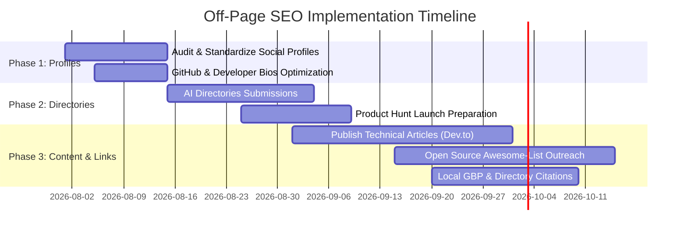

# Off-Page SEO Strategy & Authority Building Blueprint
**Target Entity**: Moiz Ahmed — Senior Full Stack Developer & Agentic AI Engineer  
**Domain**: [https://www.moizahmed.online/](https://www.moizahmed.online/)  
**Target Location**: Sialkot, Punjab, Pakistan (`PK-PB`) & Global Remote Markets  

---

## 1. Executive Summary & Core Objectives
To maximize search visibility, domain authority (DA/DR), and entity recognition across Google, Bing, and AI Search Engines (Perplexity, SearchGPT, Gemini, ChatGPT), an enterprise-grade Off-Page SEO strategy is required. 

This blueprint outlines a 5-pillar strategy focused on:
1. High-Authority Developer Profile Ecosystem & Entity Stacking
2. Product & AI Directory Backlink Submissions
3. Technical Blogging & Content Syndication
4. Local & Freelance Platform SEO (Sialkot / Pakistan / International)
5. Strategic Outreach & Open-Source Backlink Building

---

## 2. Pillar 1: High-Authority Developer Profile Ecosystem (Entity Stacking)

Creating consistent, rich, cross-linked profiles across tier-1 developer authority hubs strengthens Google Knowledge Panel recognition and transfers valuable link equity back to `https://www.moizahmed.online/`.

### Targeted Platforms & Setup Checklist

| Platform | Profile URL / Handle Structure | Link Type | Target Anchor Text / Bio Keywords |
| :--- | :--- | :--- | :--- |
| **GitHub** | `github.com/Mo0zi` | Dofollow / Profile | Moiz Ahmed - Agentic AI & Full Stack Engineer (`www.moizahmed.online`) |
| **LinkedIn** | `linkedin.com/in/moizahmed` | Profile / Experience | Senior Full Stack & Agentic AI Developer Sialkot |
| **Twitter / X** | `@Mo0ziofficiall` | Website Link | Agentic AI Engineer, RAG Pipelines, PHP MVC & Shopify Developer |
| **Dev.to** | `dev.to/mo0zi` | Profile + Article Links | Moiz Ahmed | Full Stack AI Developer (`www.moizahmed.online`) |
| **Hashnode** | `hashnode.com/@mo0zi` | Custom Domain / Bio Link | Full Stack Web & Agentic AI Engineering |
| **Medium** | `medium.com/@moizmalikofficiall` | Bio Link | AI Engineer, LangChain, FAISS, PHP MVC |
| **Stack Overflow** | `stackoverflow.com/users/moiz` | User Profile Website | Full Stack Developer & RAG Architecture Specialist |
| **Product Hunt** | `producthunt.com/@mo0zi` | Maker Profile | Founder & Developer of StitchSmart & MarketGO AI |
| **Kaggle** | `kaggle.com/mo0zi` | User Profile | Machine Learning & LLM Agent Developer |

> [!TIP]
> **Action Item**: Ensure every profile links back to `https://www.moizahmed.online/` using standardized NAP (Name, Address, Phone) & Schema attributes ("Person" entity alignment).

---

## 3. Pillar 2: AI & Software Product Directory Submissions

Submitting featured projects (**StitchSmart**, **MarketGO AI**, **Haash Wears**) to curated software and AI aggregation directories generates authoritative backlinks and direct referral traffic.

### Target Directories for Submissions

1. **AI & SaaS Directories**:
   - **Futurepedia** (`futurepedia.io`): Submit StitchSmart AI eCommerce & MarketGO AI SaaS.
   - **Toolify.ai**: List Agentic AI automation workflows and RAG pipeline capabilities.
   - **There's An AI For That** (`theresanaiforthat.com`): Register StitchSmart as a hybrid B2B/B2C AI eCommerce platform.
   - **Product Hunt**: Schedule official product launches for StitchSmart and MarketGO AI.
   - **BetaList**: Submit early-access SaaS builds for developer feedback and backlink creation.

2. **Open-Source & GitHub Awesome Lists**:
   - Submit StitchSmart / RAG repo links to GitHub repositories like `awesome-langchain`, `awesome-rag`, and `awesome-agentic-ai`.
   - Create a dedicated GitHub repository: `Awesome-Agentic-AI-Workflows` curated by Moiz Ahmed, linking to portfolio case studies.

---

## 4. Pillar 3: Technical Content Strategy & Guest Blogging

Publishing high-value technical articles establishes domain authority, generates organic search entries, and secures contextual dofollow/nofollow backlinks.

### Recommended Article Topics & Target Keywords

1. **Topic 1**: *"Building Production-Grade RAG Pipelines with LangChain, FAISS, and Google Gemini API"*
   - **Primary Keywords**: `RAG pipeline integration`, `FAISS vector database`, `LangChain tutorial`
   - **Target Outlets**: Dev.to, Hashnode, HackerNoon, Medium (Towards Data Science)
   - **Backlink Insertion**: "Check out my production implementation on [StitchSmart AI eCommerce](https://www.moizahmed.online/#work)..."

2. **Topic 2**: *"Optimizing Custom PHP MVC Architectures for High-Volume B2B eCommerce"*
   - **Primary Keywords**: `PHP MVC framework`, `B2B eCommerce performance`, `MySQL query optimization`
   - **Target Outlets**: DZone, PHP Weekly, Dev.to
   - **Backlink Insertion**: "See how I achieved 140ms TTFB on the [Haash Wears B2B platform](https://www.moizahmed.online/#work)..."

3. **Topic 3**: *"Shopify Core Web Vitals: Eliminating Script Bloat in Custom Liquid Themes"*
   - **Primary Keywords**: `Shopify custom liquid themes`, `Shopify speed optimization`, `Shopify developer Pakistan`
   - **Target Outlets**: Medium, Shopify Community Forums, LinkedIn Articles

---

## 5. Pillar 4: Local & Freelance SEO Optimization (Sialkot & Global)

### 1. Local Search & Business Profile Alignment
- **Google Business Profile (GBP)**: Register *Moiz Ahmed Engineering Consultancy* in Sialkot, Punjab, Pakistan (`PK-PB`), categorizing as *Software Company* / *Web Designer* / *AI Consultant*.
- **Local Directory Citations**: List on Pakistan tech directories (Pasha, Rozee.pk company profile, YellowPages PK) with exact NAP matching site schema:
  - **Name**: Moiz Ahmed
  - **Location**: Sialkot, Punjab, Pakistan (32.4945; 74.5229)
  - **Phone**: +92 324 9670130
  - **Website**: `https://www.moizahmed.online/`

### 2. Freelance & Client Platform Signal Interlinking
- **Fiverr Profile**: Interlink 5-Star Fiverr seller profile (`fiverr.com/s/vvNZWK1`) with portfolio testimonials.
- **Upwork & Clutch**: Maintain verified agency/freelancer profiles linking back to `www.moizahmed.online`.

---

## 6. Pillar 5: Backlink Execution Timeline (90-Day Roadmap)

### Monthly Backlink Acquisition Goals
- **Month 1**: 15-20 High-DA Foundation Profiles & Developer Directory links.
- **Month 2**: 5 Technical Blog Posts + 10 AI Directory listings (Product Hunt, Futurepedia, Toolify).
- **Month 3**: 3 Guest Posts / Case Study syndications + 10 Local citations & Awesome-List pull requests.

---

## 7. Expected SEO Impact & Metrics Tracking
- **Domain Authority (DA/DR)**: Target growth from baseline to 25+ within 6 months.
- **Organic Keyword Rankings**: Rank Top 3 for `Moiz Ahmed Developer`, `Full Stack Developer Sialkot`, `Agentic AI Engineer Pakistan`.
- **Search Engine Indexing**: 100% indexing of canonical site and structured rich snippet cards in Google, Bing, and SearchGPT.
