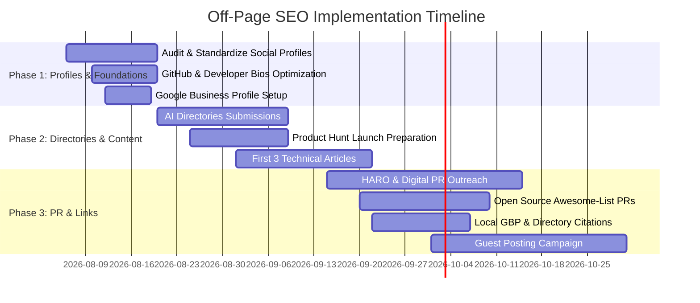

# Off-Page SEO Strategy & Authority Building Blueprint (v2.0)
**Target Entity**: Moiz Ahmed — Senior Full Stack Developer, Agentic AI Engineer & Automation Expert  
**Domain**: [https://www.moizahmed.online/](https://www.moizahmed.online/)  
**Target Location**: Sialkot, Punjab, Pakistan (`PK-PB`) & Global Remote Markets  
**Last Updated**: 2026-08-06  

---

## 1. Executive Summary & Core Objectives

To maximize search visibility, domain authority (DA/DR), and entity recognition across Google, Bing, and AI Search Engines (Perplexity, SearchGPT, Gemini, ChatGPT, Claude, Meta AI), an enterprise-grade Off-Page SEO strategy is required.

This blueprint outlines a **6-pillar strategy** focused on:
1. High-Authority Developer Profile Ecosystem & Entity Stacking
2. AI & Software Product Directory Submissions
3. Technical Blogging & Content Syndication
4. Local & Freelance Platform SEO (Sialkot / Pakistan / International)
5. Strategic Backlink Building & Digital PR
6. AI Search Optimization (GEO / AEO) & Knowledge Graph Building

---

## 2. Pillar 1: High-Authority Developer Profile Ecosystem (Entity Stacking)

Creating consistent, rich, cross-linked profiles across Tier-1 developer authority hubs strengthens Google Knowledge Panel recognition and transfers link equity back to `https://www.moizahmed.online/`.

### Targeted Platforms & Setup Checklist

| Platform | Profile URL / Handle Structure | Link Type | Target Anchor Text / Bio Keywords |
| :--- | :--- | :--- | :--- |
| **GitHub** | `github.com/Mo0zi` | Dofollow / Profile | Moiz Ahmed - Agentic AI & Full Stack Engineer (`www.moizahmed.online`) |
| **LinkedIn** | `linkedin.com/in/moizahmed-developer` | Profile / Experience | Senior Full Stack & Agentic AI Developer Sialkot — n8n Automation Expert |
| **Twitter / X** | `@Mo0ziofficiall` | Website Link | Agentic AI Engineer, RAG Pipelines, n8n Expert, PHP MVC & Shopify Developer |
| **Dev.to** | `dev.to/mo0zi` | Profile + Article Links | Moiz Ahmed \| Full Stack AI Developer & n8n Automation Expert |
| **Hashnode** | `hashnode.com/@mo0zi` | Custom Domain / Bio Link | Full Stack Web & Agentic AI Engineering, n8n Automation |
| **Medium** | `medium.com/@moizmalikofficiall` | Bio Link | AI Engineer, LangChain, FAISS, n8n, PHP MVC |
| **Stack Overflow** | `stackoverflow.com/users/moiz` | User Profile Website | Full Stack Developer & RAG Architecture Specialist |
| **Product Hunt** | `producthunt.com/@mo0zi` | Maker Profile | Founder & Developer of StitchSmart & MarketGO AI |
| **Kaggle** | `kaggle.com/mo0zi` | User Profile | Machine Learning & LLM Agent Developer |
| **Upwork** | `upwork.com/freelancers/moizahmed` | Top-Rated Profile | Agentic AI Developer, n8n Expert, Full Stack Engineer |
| **Clutch.co** | `clutch.co/profile/moizahmed` | Agency Profile | AI Developer Pakistan, Full Stack Developer Sialkot |

> [!TIP]
> **Action Item**: Ensure every profile links back to `https://www.moizahmed.online/` using standardized NAP (Name, Address, Phone) & Schema attributes ("Person" entity alignment). Keep job titles consistent: *"Senior Full Stack Developer, Agentic AI Engineer & n8n Automation Expert"*.

---

## 3. Pillar 2: AI & Software Product Directory Submissions

Submitting featured projects (**PARWAY-ERP**, **StitchSmart**, **MarketGO AI**, **Haash Wears**) to curated software and AI aggregation directories generates authoritative backlinks and direct referral traffic.

### Target Directories for Submissions

1. **AI & SaaS Directories**:
   - **Futurepedia** (`futurepedia.io`): Submit StitchSmart AI eCommerce & MarketGO AI SaaS.
   - **Toolify.ai**: List Agentic AI automation workflows and RAG pipeline capabilities.
   - **There's An AI For That** (`theresanaiforthat.com`): Register StitchSmart as a hybrid B2B/B2C AI eCommerce platform.
   - **Product Hunt**: Schedule official product launches for StitchSmart and MarketGO AI.
   - **BetaList**: Submit early-access SaaS builds for developer feedback and backlink creation.
   - **Startups.fyi**: List as AI developer & automation tools creator.
   - **G2.com**: Create profiles for ERP and AI solutions.

2. **Open-Source & GitHub Awesome Lists**:
   - Submit StitchSmart / RAG repo links to GitHub repositories: `awesome-langchain`, `awesome-rag`, `awesome-agentic-ai`, `awesome-n8n`.
   - Create a dedicated GitHub repository: `Awesome-Agentic-AI-Workflows` curated by Moiz Ahmed.

3. **n8n Automation Directories**:
   - Submit automation workflows to `n8n.io/workflows` community library.
   - Create showcase blog post on n8n.io community forums with backlinks to portfolio.

---

## 4. Pillar 3: Technical Content Strategy & Guest Blogging

Publishing high-value technical articles establishes domain authority, generates organic search entries, and secures contextual dofollow/nofollow backlinks.

### Recommended Article Topics & Target Keywords

1. **Topic 1**: *"Building Production-Grade RAG Pipelines with LangChain, FAISS, and Google Gemini API"*
   - **Primary Keywords**: `RAG pipeline integration`, `FAISS vector database`, `LangChain tutorial`, `Gemini API`
   - **Target Outlets**: Dev.to, Hashnode, HackerNoon, Medium (Towards Data Science)
   - **Backlink**: "Check out my production implementation on [StitchSmart AI eCommerce](https://www.moizahmed.online/#work)..."

2. **Topic 2**: *"n8n Automation: Building AI-Powered Business Workflows Without Code"*
   - **Primary Keywords**: `n8n automation tutorial`, `n8n workflow examples`, `business process automation`, `n8n AI integration`
   - **Target Outlets**: Dev.to, Medium, n8n Community, HackerNoon
   - **Backlink**: "See how I use n8n for [enterprise automation](https://www.moizahmed.online/#what-i-do)..."

3. **Topic 3**: *"Optimizing Custom PHP MVC Architectures for High-Volume B2B eCommerce"*
   - **Primary Keywords**: `PHP MVC framework`, `B2B eCommerce performance`, `MySQL query optimization`
   - **Target Outlets**: DZone, PHP Weekly, Dev.to

4. **Topic 4**: *"Shopify Core Web Vitals: Eliminating Script Bloat in Custom Liquid Themes"*
   - **Primary Keywords**: `Shopify custom liquid themes`, `Shopify speed optimization`, `Shopify developer Pakistan`
   - **Target Outlets**: Medium, Shopify Community Forums, LinkedIn Articles

5. **Topic 5**: *"Agentic AI vs Traditional Chatbots: Building Autonomous AI Systems with LangChain"*
   - **Primary Keywords**: `Agentic AI developer`, `LangChain agents`, `autonomous AI systems`
   - **Target Outlets**: Hashnode, Dev.to, Medium AI

---

## 5. Pillar 4: Local & Freelance SEO Optimization (Sialkot & Global)

### 1. Local Search & Business Profile Alignment
- **Google Business Profile (GBP)**: Register *Moiz Ahmed Engineering & AI Consultancy* in Sialkot, Punjab, Pakistan (`PK-PB`), categories: *Software Company* / *Web Designer* / *AI Consultant* / *IT Consultant*.
- **Local Directory Citations**: List on Pakistan tech directories (PASHA, Rozee.pk, YellowPages PK) with exact NAP:
  - **Name**: Moiz Ahmed
  - **Location**: Sialkot, Punjab, Pakistan (32.4945; 74.5229)
  - **Phone**: +92 324 9670130
  - **Website**: `https://www.moizahmed.online/`

### 2. Freelance Platform Signal Interlinking
- **Fiverr Profile**: Interlink 5-Star Fiverr seller profile (`fiverr.com/s/vvNZWK1`) with portfolio testimonials.
- **Upwork**: Maintain Top Rated freelancer profile linking back to `www.moizahmed.online`.
- **Clutch.co**: Create verified agency profile for AI & web development services.
- **PeoplePerHour**: List n8n automation and AI development services.

---

## 6. Pillar 5: Backlink Acquisition & Digital PR

### High-Priority Backlink Targets

| Target | Strategy | Anchor Text | DA Target |
| :--- | :--- | :--- | :--- |
| **Dev.to** | Publish original technical articles | Moiz Ahmed - AI Developer | DA 85+ |
| **Hashnode** | Blog posts with portfolio deep-links | Agentic AI RAG Developer | DA 79+ |
| **GitHub.com** | Open source repos, README links | Full Stack AI Engineer | DA 95+ |
| **Product Hunt** | StitchSmart / MarketGO AI launch | AI eCommerce Developer | DA 91+ |
| **Fiverr** | 5-Star profile bio link | Full Stack Developer Pakistan | DA 92+ |
| **Stack Overflow** | Profile website link | Senior Developer Profile | DA 93+ |
| **LinkedIn** | Article + profile link | Agentic AI Engineer Sialkot | DA 98+ |
| **Medium** | Technical articles | AI Developer Portfolio | DA 95+ |

### Digital PR Campaigns
1. Pitch to Pakistan tech media: `ProPakistani`, `TechJuice` — "Pakistani Developer Building Enterprise AI Systems"
2. Submit to AI newsletters: `The Rundown AI`, `Ben's Bites`, `TLDR AI`
3. HARO (Help a Reporter Out): Respond as an AI expert on Agentic AI, automation, and developer topics

---

## 7. Pillar 6: AI Search Optimization (GEO / AEO)

To appear in Google AI Overviews, ChatGPT, Perplexity, Claude, and Gemini responses:

### Entity Optimization Checklist
- ✅ JSON-LD Person schema with complete knowsAbout array
- ✅ FAQPage schema with 8 high-intent Q&As
- ✅ Review + AggregateRating schema
- ✅ LocalBusiness + ContactPoint schema
- ✅ WorkExperience schema on Career section
- ✅ SpeakableSpecification on key content blocks
- ✅ Consistent NAP across all pages and external profiles
- ✅ robots.txt explicitly allowing all AI crawlers

### Content Optimization for AI Citation
- Write factual, cite-able statements: "Moiz Ahmed is a Full Stack Developer based in Sialkot, Pakistan..."
- Use definition format for technical terms: "Agentic AI refers to autonomous AI systems that..."
- Include direct answers to common questions (FAQ format)
- Use entity associations: connect "Moiz Ahmed" to "LangChain", "n8n", "RAG", "FAISS", "Pakistan"

---

## 8. Backlink Execution Timeline (90-Day Roadmap)

### Monthly Backlink Acquisition Goals
- **Month 1**: 20-25 High-DA Foundation Profiles & Developer Directory links.
- **Month 2**: 5 Technical Blog Posts + 10 AI Directory listings (Product Hunt, Futurepedia, Toolify).
- **Month 3**: 3-5 Guest Posts / Case Study syndications + 15 Local citations + Awesome-List PRs.

---

## 9. Expected SEO Impact & KPI Targets

| Metric | Baseline | 3-Month Target | 6-Month Target |
| :--- | :--- | :--- | :--- |
| **Domain Authority (Moz DA)** | ~5 | 15+ | 25+ |
| **Domain Rating (Ahrefs DR)** | ~5 | 20+ | 30+ |
| **Ranking: "Moiz Ahmed Developer"** | Top 10 | Top 3 | #1 |
| **Ranking: "Full Stack Developer Sialkot"** | Unranked | Top 10 | Top 5 |
| **Ranking: "n8n Expert Pakistan"** | Unranked | Top 5 | Top 3 |
| **Ranking: "Agentic AI Developer Pakistan"** | Unranked | Top 10 | Top 5 |
| **Google Search Console Clicks/Month** | Baseline | 3x | 10x |
| **AI Search Citations (Perplexity/ChatGPT)** | 0 | 3+ | 10+ |

---

## 10. Tools for Monitoring & Execution

| Tool | Purpose |
| :--- | :--- |
| **Google Search Console** | Indexing, click data, Core Web Vitals |
| **Bing Webmaster Tools** | Bing indexing + Copilot visibility |
| **Ahrefs / SEMrush** | Backlink tracking, keyword rankings |
| **Moz Link Explorer** | DA monitoring |
| **Google Analytics 4** | Traffic, engagement, conversions |
| **Google Rich Results Test** | Schema validation |
| **PageSpeed Insights** | Core Web Vitals monitoring |
| **Schema Markup Validator** | schema.org validation |
